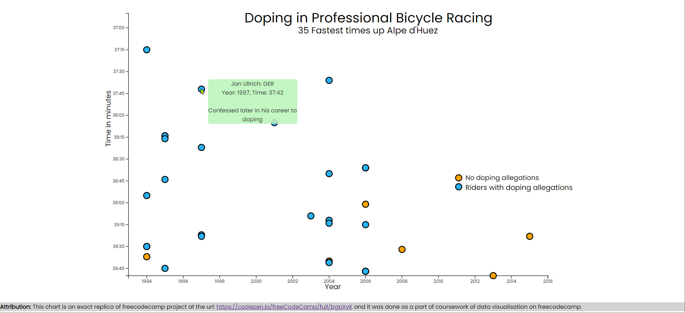

# D3 scatter plot
This chart shows doping incidents in bicycle racing in each year and their relevance to finish time by the winner. Hover over the data points to get more information about that incident. Orange color circles represent winners without doping incident. Blue color represent winners with doping incident.
_You can insert your data by replacing the json file link in fetch method._

Check out the deployed app at url: [https://gorgeous-sopapillas-268351.netlify.app/](https://gorgeous-sopapillas-268351.netlify.app/)

**Attribution:** This chart is an exact replica of freecodecamp project at the url: [https://codepen.io/freeCodeCamp/full/bgpXyK](https://codepen.io/freeCodeCamp/full/bgpXyK) and it was done as a part of coursework of data visualisation on freecodecamp.

A Pen created on CodePen.io. Original URL: [https://codepen.io/sathishkannan/pen/ExLQwBa](https://codepen.io/sathishkannan/pen/ExLQwBa).

